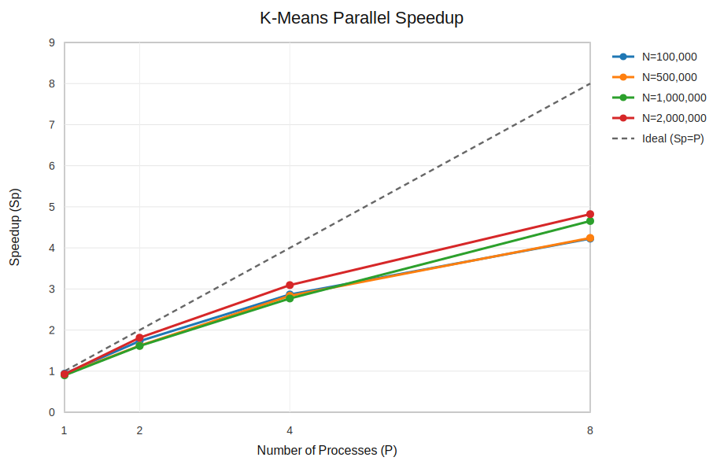

# K-Means 并行实验结果

实验参数：d=16，K=8，max_iter=20，seed=42。每组配置运行 3 次，表中耗时为平均值。

## 汇总表格

### N=100,000 的加速效果

串行基准耗时：120.1 ms

| 进程数 P | MPI 耗时 (ms) | 加速比 | 效率 |
|---:|---:|---:|---:|
| 1 | 128.0 | 0.94x | 93.8% |
| 2 | 69.3 | 1.73x | 86.6% |
| 4 | 41.9 | 2.87x | 71.7% |
| 8 | 28.4 | 4.23x | 52.8% |

### N=500,000 的加速效果

串行基准耗时：555.7 ms

| 进程数 P | MPI 耗时 (ms) | 加速比 | 效率 |
|---:|---:|---:|---:|
| 1 | 606.0 | 0.92x | 91.7% |
| 2 | 342.9 | 1.62x | 81.0% |
| 4 | 196.1 | 2.83x | 70.9% |
| 8 | 131.0 | 4.24x | 53.0% |

### N=1,000,000 的加速效果

串行基准耗时：1122.1 ms

| 进程数 P | MPI 耗时 (ms) | 加速比 | 效率 |
|---:|---:|---:|---:|
| 1 | 1249.5 | 0.90x | 89.8% |
| 2 | 695.7 | 1.61x | 80.7% |
| 4 | 405.4 | 2.77x | 69.2% |
| 8 | 241.1 | 4.65x | 58.2% |

### N=2,000,000 的加速效果

串行基准耗时：2365.3 ms

| 进程数 P | MPI 耗时 (ms) | 加速比 | 效率 |
|---:|---:|---:|---:|
| 1 | 2554.8 | 0.93x | 92.6% |
| 2 | 1304.1 | 1.81x | 90.7% |
| 4 | 764.5 | 3.09x | 77.4% |
| 8 | 490.6 | 4.82x | 60.3% |

## 关键发现

1. 最大加速比出现在 N=2,000,000、P=8：4.82x。
2. 单进程 MPI 存在额外开销，因此 P=1 时加速比低于 1。
3. 8 进程下，N=2,000,000 的效率最高，为 60.3%，说明数据规模增大后计算占比提高，通信和调度开销被更好摊薄。
4. P 从 1 增加到 8 时，整体耗时明显下降；但效率随进程数增加而下降，主要受 MPI 通信、数据分发和进程调度开销影响。

## 加速比图

## 原始数据文件

- `results/current_experiment_results.csv`
- `results/current_speedup.svg`
